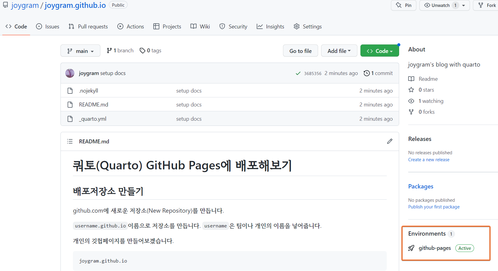

# 쿼토(Quarto) GitHub Pages에 배포해보기 


## 배포저장소 만들기 

github.com에 새로운 저장소(New Repository)를 만듭니다. 

`username.github.io`이름으로 저장소를 만듭니다. `username`은 팀이나 개인의 이름을 넣어줍니다. 

 개인의 깃헙페이지를 만들어보겠습니다. 

```
joygram.github.io
```


## 쿼토(quarto) 페이지 정보(_quarto.yml) 만들기 

```
#_quarto.yml
project:
  type: website 
  output-dir: docs
```

### github의 'Jekyll' 툴 동작하지 않게 하기 

`.nojekyll` 파일 만들기

```
touch .nojekyll
or 
copy NUL .nojekyll
```

### git에 올리기 

`quarto render`

`git push`를 진행하면 github-pages 항목을 확인할 수 있습니다.  

